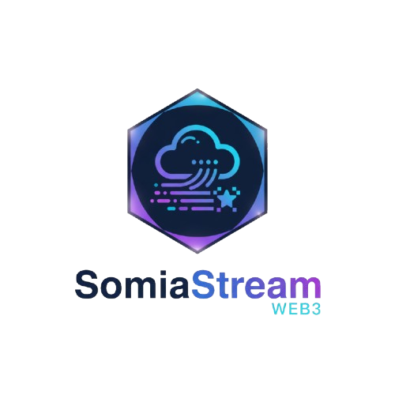

# Somnia Pulse - Web3 Real-Time Dashboard



**Somnia Pulse** is a real-time Web3 dashboard built for monitoring crypto transactions, token metrics, and user activity on the Somnia Testnet. It leverages **Somnia Data Streams (SDS)** and React/Next.js to display live blockchain events and analytics.

---

## 🚀 Features

* **Connect Wallets Instantly**: Supports multiple wallets using a simple connect button.
* **Real-Time Metrics**:

  * Total Transactions
  * SOMI Token Price
  * Active Users
* **Live Transaction Feed**:

  * Displays wallet addresses, transaction hashes, values, timestamps, and status.
  * Updates in real-time via SDS.
* **Responsive UI**:

  * Mobile-friendly and desktop-ready.
  * Clean, modern, and dark-mode friendly.
* **Fallback Simulations**:

  * Visual updates continue even if real-time streams are delayed.
* **SDS Smart Contract Integration**:

  * Fully integrated with Somnia Testnet event streams.
  * Decodes live blockchain events to display meaningful dashboard data.

---

## 🛠 Tech Stack

* **Frontend**: Next.js 13 (App Router), React 18, TypeScript
* **Blockchain Integration**: Somnia SDK, Viem, SDS Smart Contracts
* **Styling**: TailwindCSS, Lucide-React icons
* **Analytics**: Vercel Web Analytics
* **Wallet Support**: Metamask, WalletConnect, Phantom (via Somnia provider)

---

## ⚡ Getting Started

### 1. Clone the repository

```bash
git clone https://github.com/yourusername/somnia-pulse.git
cd somnia-pulse
```

### 2. Install dependencies

```bash
pnpm install
# or npm install / yarn install
```

### 3. Configure your environment

* Add `.env` file if needed.
* Ensure Metamask is connected to the **Somnia Testnet**:

  * RPC URL: `https://dream-rpc.somnia.network`
  * Chain ID: `50312`
  * Currency Symbol: `STT`
  * Block Explorer: (if available)

### 4. Run locally

```bash
pnpm dev
# opens http://localhost:3000
```

### 5. Connect Wallet

Click **Connect Wallet** to start fetching real-time metrics and transactions.

---

## 🖼 Screenshots

| Dashboard Overview                  | Live Transactions                             |
| ----------------------------------- | --------------------------------------------- |
|  |  |

---

## 🧩 How It Works

1. **Wallet Connection**: User connects via Metamask or other supported wallets.
2. **SDS Initialization**: The `useSDS` hook connects to the Somnia Testnet via the SDK.
3. **Real-Time Metrics**: The dashboard subscribes to events for transactions, token price, and active users.
4. **Transaction Feed**: Events emitted from the SDS smart contract are decoded and displayed dynamically.
5. **Fallback Simulation**: In the absence of real-time events, simulated metrics keep the UI lively.

---

## 💡 Project Status

* ✅ Wallet connection working
* ✅ Live metrics grid functional
* ✅ Transaction feed fetching events
* ✅ Fully functional dashboard

---

## 🧑‍💻 Contributing

1. Fork the repository
2. Create a feature branch: `git checkout -b feature/my-feature`
3. Commit your changes: `git commit -m "Add my feature"`
4. Push to the branch: `git push origin feature/my-feature`
5. Open a pull request

---

## 📄 License

MIT License – see [LICENSE](LICENSE) for details.

---

## 🌐 Live Demo

[Somnia Pulse Live](https://somnia-stream-neon.vercel.app/)
